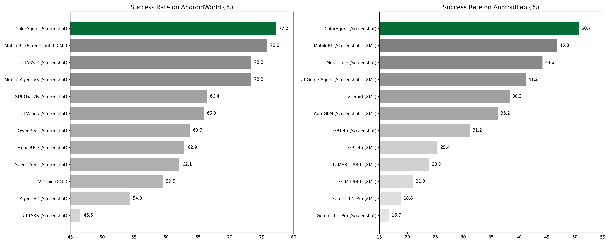
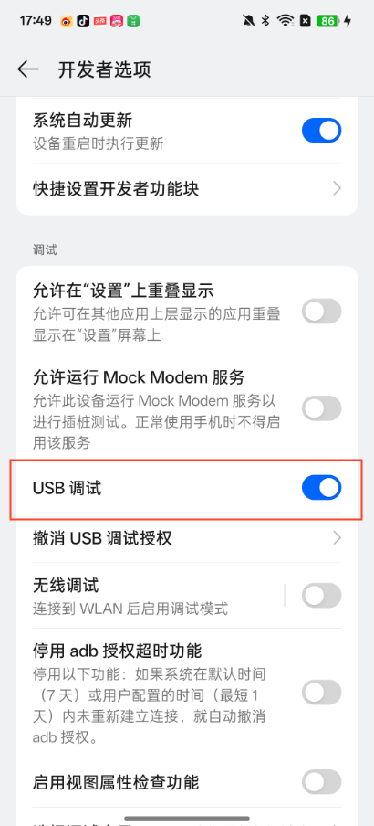
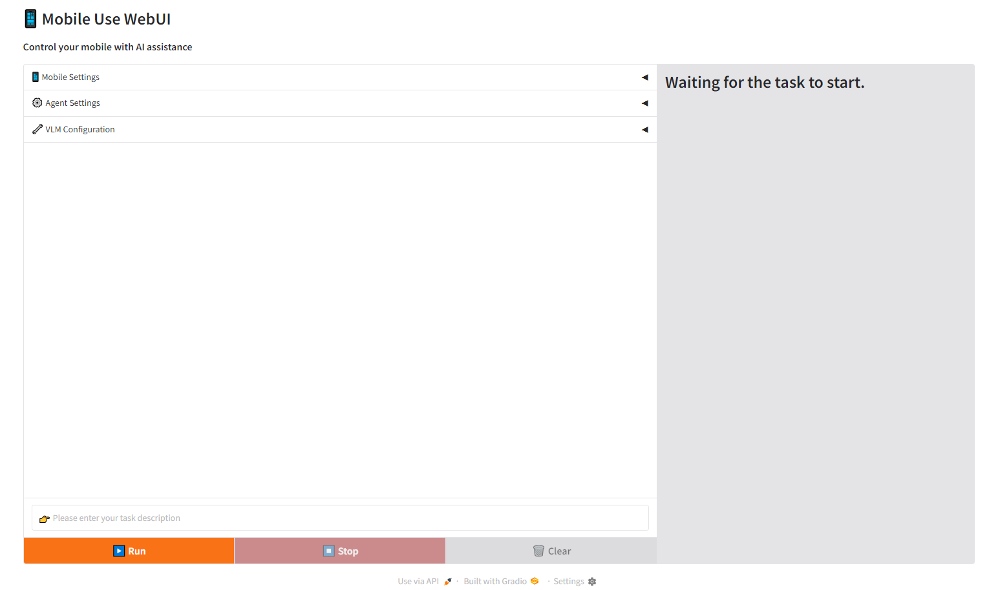
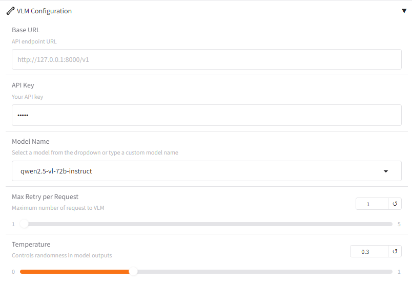
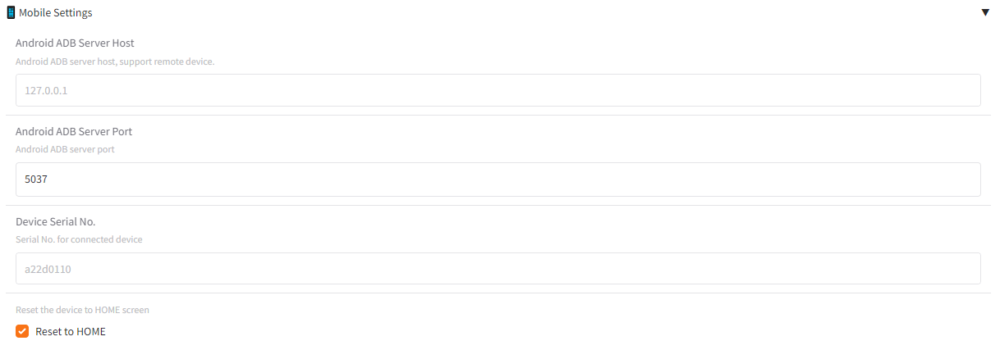
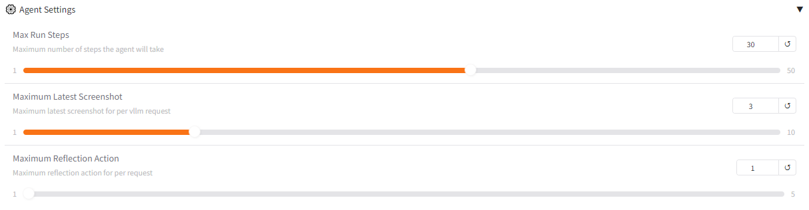

# Mobile Use 📱
[](https://opensource.org/licenses/MIT)
[](https://github.com/MadeAgents/mobile-use)
[](https://arxiv.org/abs/2507.16853)
[](https://arxiv.org/abs/2510.19386)

<h2 style="text-align: center;">Mobile Use​: Your AI assistant for mobile - Any app, any task.</h2>


[ [English](../README.md) | [中文](README_zh.md) ]

https://github.com/user-attachments/assets/5c4d3ce8-0135-4e6e-b003-b20f81f834d4

用户在 Web 界面输入自然语言指令，Mobile Use 的 GUI 智能体自动操作手机并完成任务。

**⚠️特别提醒**：操作动作由智能体自主决定，可能存在不可控的操作风险，建议体验是时刻关注手机动态如遇到操作风险及时终止任务或者使用测试手机进行体验，避免误操作带来问题。

## 🎉 News
- **[2025/10/22]**: 我们的[技术报告](https://arxiv.org/abs/2510.19386) **ColorAgent: Building A Robust, Personalized, and Interactive OS Agent** 已发布！代码已更新，同时支持 ColorAgent 与 MobileUse 的智能体框架。
- **[2025/09/19]**: 我们的[论文](https://arxiv.org/abs/2507.16853) "MobileUse: A Hierarchical Reflection-Driven GUI Agent for Autonomous Mobile Operation" 已被 NeurIPS 2025 接收！
- **[2025/09/10]**: 我们在 AndroidWorld 评测集上取得了 75% 的成功率，在所有纯截图方案中位列第一！更新后的代码将很快发布。
- **[2025/06/13]**: 我们的[论文](https://arxiv.org/abs/2507.16853) "MobileUse: A Hierarchical Reflection-Driven GUI Agent for Autonomous Mobile Operation" 现已发布！
- **[2025/05/13]**: Mobile Use v0.3.0 发布！支持 AndroidLab 动态环境评估！在 [AndroidLab](https://github.com/THUDM/Android-Lab) 和 [AndroidWorld](https://github.com/google-research/android_world) 基准上均取得显著提升。
- **[2025/03/28]**: 在 AndroidWorld 动态环境中运行 Mobile Use 的[文档](../benchmark/android_world/README.md)现已发布！
- **[2025/03/17]**: Mobile Use 现在支持[多智能体](../mobile_use/agents/multi_agent.py)框架！配备规划、反思、记忆和进展机制，在 AndroidWorld 上表现出色！
- **[2025/03/04]**: Mobile Use 首次发布！同时发布 [mobile-use](https://github.com/MadeAgents/mobile-use) 库 v0.1.0，为您提供“任何应用，任何任务”的移动设备 AI 助手！

## 📊 Benchmark


## ✨ 核心特性
- **自动操作手机**：基于用户的输入任务描述，自动操作UI完成任务
- **智能元素识别**：解析GUI布局并定位操作目标
- **复杂任务处理**：支持复杂指令分解和多步操作


<!-- ## 🛠️ 技术架构 -->


## 🚀 快速开始
`mobile-use` 需要使用 [adb](https://developer.android.com/tools/adb) 来控制手机，需要预先安装相关工具并使用USB连接手机和电脑。

### 1. 安装 SDK Platform-Tools 工具
- Step 1. 下载 SDK Platform-Tools 工具, 点击 [这里](https://developer.android.com/tools/releases/platform-tools#downloads).
- Step 2. 解压文件并将 `platform-tools` 路径添加至环境变量.

    - Windows
        Windows系统可以 图形界面或者命令方式添加 `platform-tools` 路径至 `PATH` 环境变量，命令行方式如下：
        In Windows, you can add the `platform-tools` PATH to the ` Path` environment variable on the graphical interface (see [here](https://www.architectryan.com/2018/03/17/add-to-the-path-on-windows-10)) or through the command line as follows:
        ```
        setx PATH "%PATH%;D:\your\download\path\platform-tools"
        ```

    - Mac/Linux
        ```
        $ echo 'export PATH=/your/downloads/path/platform-tools:$PATH' >> ~/.bashrc
        $ source ~/.bashrc
        ```
- Step 3. 打开命令行，输入 `adb devices` (Windows: `adb.exe devices`) 验证 adb 是否可用

### 2. 启用开发者模式并打开手机上的USB调试


对于 HyperOS 或 MIUI，你需要同时打开 "USB调试(安全设置)"。

### 3. 通过USB线连接电脑和手机，并验证 adb 是否已连接
在命令行终端执行 `adb devices` （Windows：`adb.exe devices`）命令，如果列出设备号表示已连接成功，正确的日志如下：
```
List of devices attached
a22d0110        device
```

### 4: 安装 mobile-use
#### Option 1: 直接安装
Python>=3.10，推荐使用 Python 3.12。
```
pip install mobile-use
```
注意，通过此方法安装的 mobile-use 可能不是最新的.

#### Option 2: 从源码安装
```
# Clone github repo
git clone https://github.com/MadeAgents/mobile-use.git

# Change directory into project directory
cd mobile-use

# Install uv if you don't have it already
pip install uv

# Create a virtual environment and install dependencies
# We support using Python 3.10, 3.11, 3.12
uv venv .venv --python=3.12

# Activate the virtual environment
# For macOS/Linux
source .venv/bin/activate
# For Windows
.venv\Scripts\activate

# Install mobile-use with all dependencies (pip >= 21.1)
uv pip install -e .
```


### 5. 启动服务
```
python -m mobile_use.webui
```

### 6. 使用方式
待服务启动成功之后，在浏览器打开地址：http://127.0.0.1:7860，即可进入到 WebUI 页面，如下图所示：



点击 VLM Configuration 设置多模态大语言模型 Base URL 和 API Key，推荐使用 Qwen2.5-VL 系列的多模态大语言模型。




在左下方的输入框输入任务描述，点击开始即可执行任务。

### 7. 支持中文字符 (可选)

如果你想在手机上输入中文字符，比如让 MobileUse 执行这样的命令：在美团app里搜索咖啡，你需要

- Step 1. 下载 ADBKeyBoard apk, 点击 [这里](https://github.com/senzhk/ADBKeyBoard).
- Step 2. 将 ADBKeyBoard 安装到你的手机里.
  ```
  adb install <path-to-ADBKeyboard.apk>
  ```


## 🎉 More Demo
Case1：Search the latest news of DeepSeek-R2 in Xiaohongshu APP and forward one of the news to the Weibo App

https://github.com/user-attachments/assets/c44ddf8f-5d3f-4ace-abb3-fab4838b68a4


Case2：Order 2 Luckin coffees with Meituan, 1 hot raw coconut latte standard sweet, and 1 cold light jasmine

https://github.com/user-attachments/assets/6130e87e-dd07-4ddf-a64d-051760dbe6b3


Case3：用美团点一杯咖啡，冰的，标准糖

https://github.com/user-attachments/assets/fe4847ba-f94e-4baa-b4df-857cadae5b07


Case4：用美团帮我点2杯瑞幸咖啡，要生椰拿铁标准糖、热的

https://github.com/user-attachments/assets/5c4d3ce8-0135-4e6e-b003-b20f81f834d4


Case5：在浏览器找一张OPPO Find N5图片，询问DeepSeek应用该手机介绍信息，将找到的图片和介绍信息通过小红书发布

https://github.com/user-attachments/assets/4c3d8800-78b7-4323-aad2-8338fe81cb81


Case6：帮我去OPPO商城、京东、以及淘宝分别看一下oppofind n5售价是多少

https://github.com/user-attachments/assets/84990487-f2a3-4921-a20e-fcdebfc8fc60

Case7: Turn on Bluetooth and WIFI

https://github.com/user-attachments/assets/c82ae51e-f0a2-4c7b-86e8-e3411d9749bb


## ⚙️ 高级用法

### 更多参数配置
**📱 Mobile Settings**
通过 `Android ADB Server Host` 和 `Android ADB Server Port` 可以指定 Android ADB 服务的地址和端口，可用于远程设备连接或者本地非默认端口的 Android ADB 服务。当存在多台设备时，需要通过 `Device Serial No.` 指定使用那一台设备。`Reset to HOME` 参数表示执行任务时是否将手机返回到主页再执行，如果时继续上一个任务，则需要取消该选项。



**⚙️ Agent Settings**

`Max Run Steps` 参数是指定 Agent 最大迭代步数，当前任务超出最大迭代步数时，任务将被停止。因此，对于操作步数较多的复杂任务，建议设置较大值。`Maximum Latest Screenshot` 用于控制 Agent 可见的最新截图数量；由于图片会消耗更多 Token，当任务步数较多时，可仅选取最新的 `Maximum Latest Screenshot` 张截图用于生成下一步操作。`Maximum Action Retry` 用于控制单步动作解析失败时的最大重试次数，其值越大，Agent 的容错率越高，但处理时间也会更长。通过点击 **⚙️ Agent Settings** 选项可以设置这三个参数的值：




**🔧 VLM Configuration**
点击 `VLM Configuration` 可指定多模态大语言模型的 Base URL 和 API Key，以及模型名称和温度系数，推荐使用 Qwen2.5-VL 系列的多模态大语言模型。


### 在 Python 脚本中使用 Agent 智能体
```python
import logging
import mobile_use
from mobile_use.utils.logger import setup_logger

setup_logger(name='mobile_use')
logger = logging.getLogger('mobile_use')

# 选择 Agent 类型并设置配置文件
# 所有 Agent 可在 `mobile_use/agents` 目录中找到
# 示例配置位于 `config` 目录
config_path = "config/mobileuse.yaml"
agent = mobile_use.Agent.from_params(dict(
      type="MultiAgent",
      config_path=config_path,
    ))

# 运行一个任务
goal = "Close Wifi"

# 方式一：直接使用 `run` 运行任务
agent.set_max_steps(10)
agent.run(input_content = goal)

# 方式二：仅使用 `step` 自定义运行流程
agent.reset(goal)
for i in range(10):
    agent.step()
    agent.curr_step_idx += 1
    if agent.status == mobile_use.AgentStatus.FINISHED:
        break
```

### 评测
见 [benchmark/android_world/README.md](../benchmark/android_world/README.md) 和 [benchmark/android_lab/README.md](../benchmark/android_lab/README.md).

## 🗺️ Roadmap
- [x] 改进智能体的记忆和提升智能体的反思能力 (summarize, compress.)
- [x] 基于多智能体探索提升整体任务的效果
- [x] 提供一个关于AndroidWorld动态环境的评估流程
- [ ] 开发一个可以直接安装在手机上的APP


## 🌱 参与贡献
我们欢迎各种形式的贡献！请阅读贡献指南了解：
- 如何提交issue报告问题
- 参与功能开发，详见[开发文档](develop_zh.md)
- 代码风格和质量标准，详见[开发文档](develop_zh.md)
- 文档改进建议方式


## 📜 许可协议
本项目采用 MIT 许可证，允许自由使用和修改代码，但需保留原始版权声明。


## 📚 引用
如果您在您的研究或工作中使用了本项目，请引用：
```
@inproceedings{li2025mobileuse,
  title={MobileUse: A Hierarchical Reflection-Driven {GUI} Agent for Autonomous Mobile Operation},
  author={Ning Li and Xiangmou Qu and Jiamu Zhou and Jun Wang and Muning Wen and Kounianhua Du and Xingyu Lou and Qiuying Peng and Jun Wang and Weinan Zhang},
  booktitle={The Thirty-ninth Annual Conference on Neural Information Processing Systems},
  year={2025},
  url={https://openreview.net/forum?id=KR6tnkb6h4}
}

@article{li2025coloragent,
  title={ColorAgent: Building A Robust, Personalized, and Interactive OS Agent},
  author={Li, Ning and Lin, Qiqiang and Wu, Zheng and Mo, Xiaoyun and Zhang, Weiming and Zhao, Yin and Qu, Xiangmou and Zhou, Jiamu and Wang, Jun and Zheng, Congmin and others},
  journal={arXiv preprint arXiv:2510.19386},
  year={2025}
}
```

## 🤝 致谢
本项目得益于：
- 灵感来自 [browser-use](https://github.com/browser-use/browser-use)
- 智能体的多模态大模型是基于 [Qwen2.5-VL](https://huggingface.co/collections/Qwen/qwen25-vl-6795ffac22b334a837c0f9a5)
- 多智能体方案的实现是基于 [Mobile-Agent](https://github.com/X-PLUG/MobileAgent)
- Web UI 是基于 [Gradio](https://www.gradio.app)

感谢他们的精彩工作。
